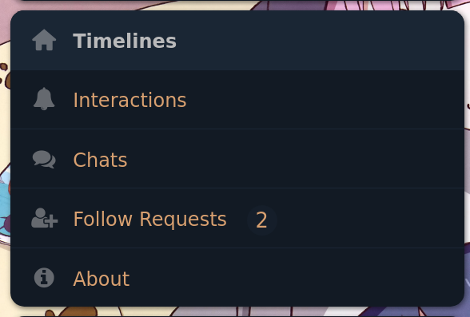
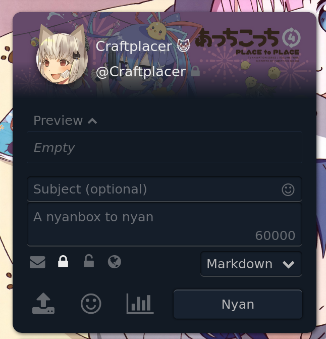
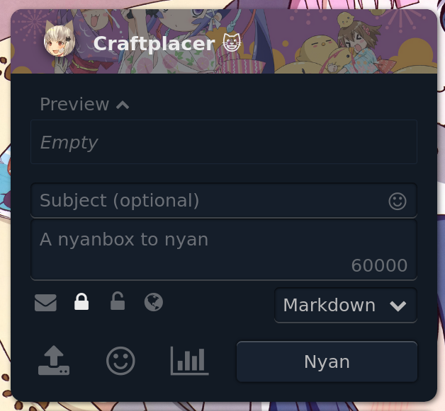

# Pleroma User Styles

This repository contains all user styles I've written for the Pleroma-FE.

## All styles
- [Compact navigation bar](#compact-navigation-bar)
- [Short user info](#short-user-info)
- [Better autocompletion highlight](#better-autocompletion-highlight)

## [Compact navigation bar](https://craftplacer.github.io/pleroma-user-styles/compact-navigation-bar.user.css)

| Before | After |
| ------ | ----- |
|  |  |

## [Short user info](https://craftplacer.github.io/pleroma-user-styles/short-user-info.user.css)

| Before | After |
| ------ | ----- |
|  |  |

### [Better autocompletion highlight](https://craftplacer.github.io/pleroma-user-styles/better-autocompletion-highlight.user.css)

No preview yet.
